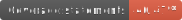
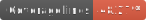

## 🤖 Monitoring

[](https://app.netlify.com/sites/gid-coders-recruitment-task/deploys)

## 🚀 Tests






# GID-CODERS-Recruitment-Task

Recruitment task for [GID CODERS](https://gidcoders.pl/home/).

<br />

## 📎 Description

```
Recruitment Task.
```

## 🔌 Technologies


## 📺 Demo

```
Go to DEMO
```

## 💿 Install & config

```
- clone this repository
- install packages in the main directory: `npm install` or `npm i`

- run App: `npm run start`
- build App: `npm run build`

- test App: `npm run test`
- generate coverage: `npm run test:coverage`
- generate badges: `npm run test:badges`

- docs generate: `npm run jsdoc`
```
